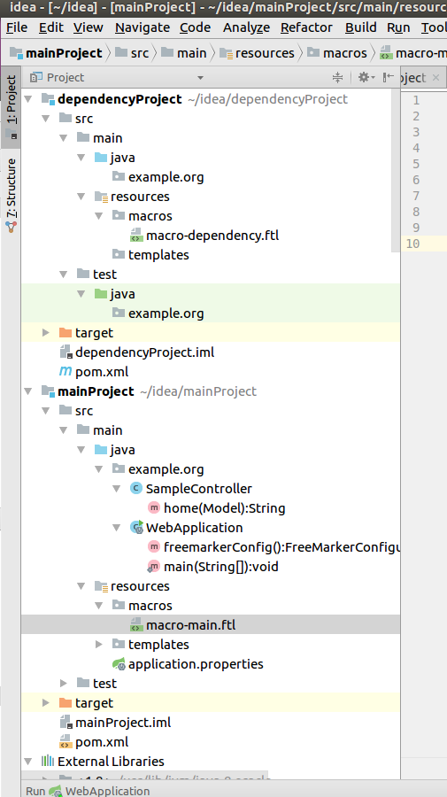

# multi-freemarker-roots

This project was created to illustrate issues we are having with a much larger project where we access Freemarker 
templates from multiple locations in the project classpath.  In this example, the main.ftl template access macros from 
both the mainProject Maven project as well as the dependencyProject Maven project.

Features shared by this and our main project
- Spring
- Java
- Freemarker
- Freemarker is configured to load templates from multiple locations on the classpath
- Freemarker files are located in multiple dependent Maven projects

Differences
- This project uses Spring Boot, the main project does not
- This project is much smaller

Import the two subdirectories as two Maven modules into your project. Import the entire Git project folder 
as a single IntelliJ project.

Run the "WebApplication" class in the mainProject to see that the Freemarker calls are working.

Project tree:

